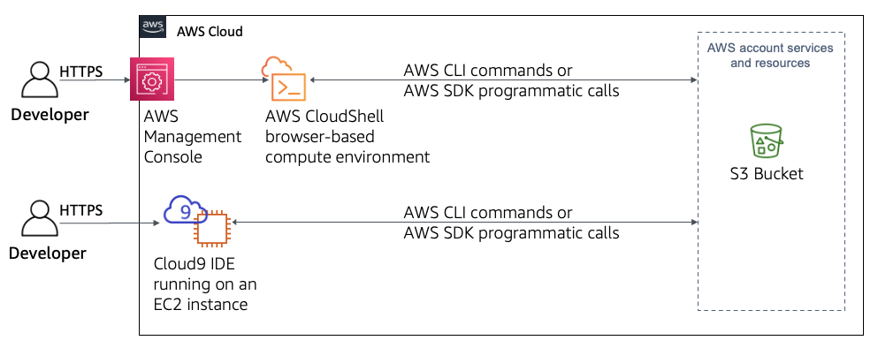

# Exploring AWS CloudShell and an IDE

In this project I will connect to an AWS CloudShell environment and explore its capabilities. I will also launch an instance of AWS Cloud9, connect to it, and explore the layout and functionality of its integrated development environment (IDE).

by the end of this project, I will have created an AWS Cloud9 instance and performed the actions that are shown below:

